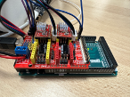
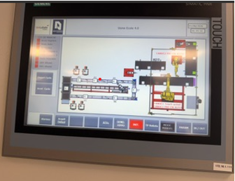

# Conception et Prototypage

Cette section retrace les étapes de développement technique du projet, depuis les premières modélisations virtuelles jusqu'à l'intégration finale des composants dans l'armoire de l'Usine École 4.0.

---

## 1. Modélisation CAO des Pièces (Onshape)

Découvrez ci-dessous les trois pièces principales conçues sur-mesure pour notre rack de stockage de 14 bobines. Vous pouvez interagir avec chaque modèle à l'aide de votre souris (clic gauche pour tourner, clic droit pour déplacer, molette pour zoomer).

### Support Bobine - Partie 1
*Première section structurelle du support amovible conçue pour s'adapter sur les profilés aluminium de l'armoire.*

<model-viewer 
  src="images/support_bobine_partie1.glb" 
  camera-controls 
  touch-action="pan-y" 
  alt="Modèle 3D du support bobine partie 1" 
  style="width: 100%; height: 400px; background-color: #ffffff; border: 1px solid #dee2e6; border-radius: 6px;">
</model-viewer>

 

### Support Bobine - Partie 2
*Seconde section mécanique complétant le système de maintien et assurant le dévidage fluide du filament.*

<model-viewer 
  src="images/support_bobine_partie2.glb" 
  camera-controls 
  touch-action="pan-y" 
  alt="Modèle 3D du support bobine partie 2" 
  style="width: 100%; height: 400px; background-color: #ffffff; border: 1px solid #dee2e6; border-radius: 6px;">
</model-viewer>

 

### Support Capteur
*Platine spécifique développée pour fixer le capteur optique ToF infrarouge en position haute stable au-dessus du filament.*

<model-viewer 
  src="images/support_capteur.glb" 
  camera-controls 
  touch-action="pan-y" 
  alt="Modèle 3D du support capteur" 
  style="width: 100%; height: 400px; background-color: #ffffff; border: 1px solid #dee2e6; border-radius: 6px;">
</model-viewer>

---

## 2. Prototypage Électronique & Acquisition

Avant de déployer le système à grande échelle, un prototype unitaire a été réalisé pour valider le comportement du capteur de distance.

* **Étalonnage unitaire :** Tests sur table de la loi de comportement du capteur ToF en fonction du vidage progressif d'une bobine témoin.
* **Centrale d'acquisition :** Assemblage et câblage électrique du réseau de capteurs sur une carte Arduino pour fiabiliser les signaux continus de terrain.

{: style="width: 100%; border: 1px solid #dee2e6; border-radius: 6px;"}
*Vue de notre centrale d'acquisition et du câblage de la carte Arduino.*

---

## 3. Développement de l'Interface Automate & IHM

En parallèle du montage physique, la couche logicielle industrielle a été développée pour traiter les informations de terrain.

* **Rétro-ingénierie logicielle :** Prise en main de TIA Portal V20 et capitalisation sur l'existant pour moderniser le noyau logique de l'armoire.
* **Bloc de calcul (FC) :** Création de l'algorithme mathématique interpolant la distance mesurée (mm) pour la traduire en une jauge de volume dynamique exprimée en pourcentage (%).
* **Supervision :** Création des écrans graphiques sur l'IHM Siemens, incluant le mapping complet des variables et la configuration des seuils d'alertes de maintenance.

{: style="width: 100%; border: 1px solid #dee2e6; border-radius: 6px;"}
*Vue finale de la page de supervision développée sur TIA Portal pour l'armoire de stockage.*

---

## 4. Intégration Finale & Recette

La dernière étape a matérialisé le passage du virtuel au réel dans l'Usine École 4.0.

* **Montage mécanique :** Fixation des profilés et des racks imprimés en 3D dans l'armoire technique.
* **Tests de recette (Run) :** Simulation d'alertes de fin de fil et validation des remontées en temps réel sur l'IHM, mesurant un écart de 0% entre la masse de filament restante théorique et l'affichage de supervision.
