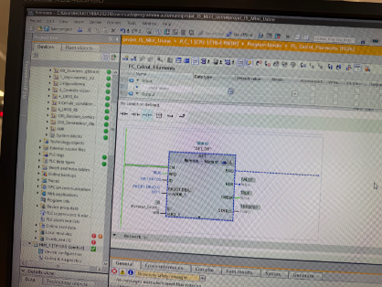
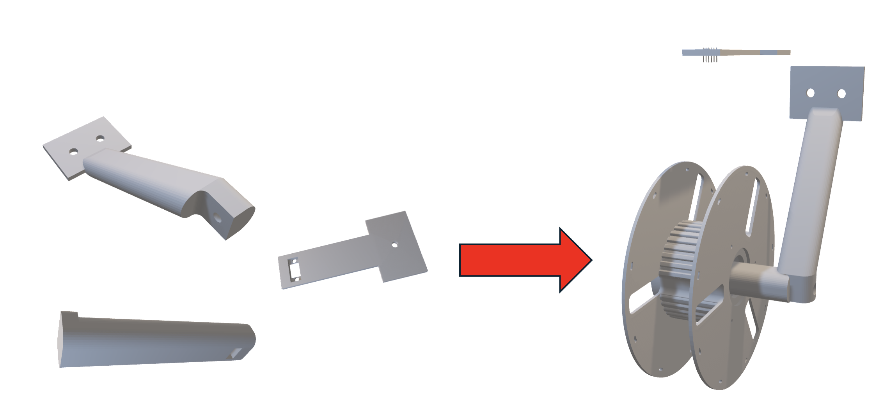
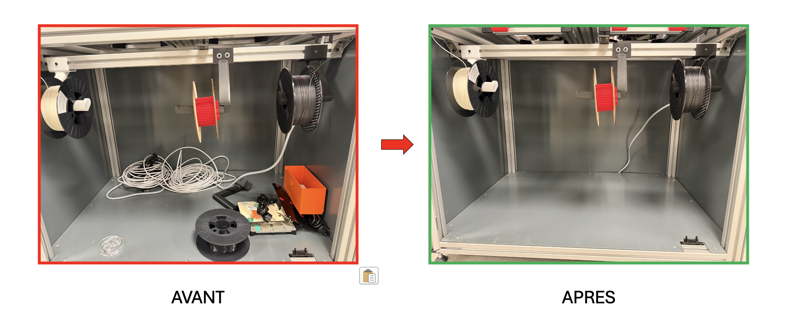

# Étude et Choix Techniques

[cite_start]Cette section détaille les analyses, les choix technologiques et les justifications d'ingénierie qui ont guidé notre équipe dans la résolution des défis de l'Usine École 4.0[cite: 1, 59].

---

## 1. Choix du Système de Mesure : Capteur de Distance ToF

[cite_start]Pour connaître la quantité de filament restant sans perturber le dévidage mécanique, nous avons opté pour une mesure de distance plutôt qu'un pesage direct[cite: 24, 27]. [cite_start]Notre choix s'est porté sur un capteur de distance optique ToF (Time-of-Flight) fonctionnant par l'émission d'un signal lumineux infrarouge qui se réfléchit sur la bobine de filament[cite: 158, 160, 161, 162]. [cite_start]Le système calcule le temps aller-retour du signal pour en déduire la distance exacte en millimètres ($mm$) séparant le capteur du filament[cite: 163, 164].

Cette solution offre l'avantage majeur d'éliminer tout contact physique ou frottement sur le fil pendant l'impression 3D. [cite_start]De plus, elle permet d'établir une loi mathématique directe pour corréler la distance mesurée au volume et au pourcentage (%) de matière disponible[cite: 37, 130].

---

## 2. Architecture Électronique & Réseau

[cite_start]L'acquisition de données s'appuie sur une structure électronique locale robuste avant d'attaquer la couche industrielle de l'usine[cite: 73]. [cite_start]La carte Arduino gère la communication I2C avec le capteur ToF pour assurer une lecture continue et rapide des distances de terrain[cite: 172, 174, 175, 176]. 

[cite_start]Les données brutes sont ensuite transmises à l'automate central Siemens de l'usine école, où elles sont converties et exploitées à l'aide d'un bloc de calcul dédié nommé "FC Calcul_Filaments" programmé sous TIA Portal V20[cite: 46, 71, 119].

{: style="width: 100%; border: 1px solid #dee2e6; border-radius: 6px;"}
[cite_start]*Copie d'écran de notre bloc FC de calcul et du mapping de variables sous TIA Portal V20[cite: 119].*

---

## 3. Choix Matériels et CAO (Conception Assistée par Ordinateur)

[cite_start]La conception du rack modulaire a été étudiée pour s'intégrer parfaitement à l'environnement contraint de l'armoire de stockage[cite: 63]. [cite_start]Les différentes pièces ont été modélisées sur-mesure pour soutenir efficacement l'axe de rotation des bobines tout en maintenant le capteur ToF en position haute stable[cite: 135]. [cite_start]Les supports ont été imprimés en 3D au Makerspace afin de garantir une excellente tenue mécanique face au poids cumulé des filaments[cite: 63].

{: style="width: 100%; max-height: 350px; object-fit: contain;"}
[cite_start]*Conception des axes de fixation et intégration de l'emplacement du capteur optique[cite: 135].*

---

## 4. Rationalisation de l'Espace : Application du 5S

[cite_start]Pour répondre au défi physique de l'armoire, où l'encombrement et la recherche d'outils ralentissaient la production de 15%, notre équipe a déployé un chantier 5S complet[cite: 25, 47, 142]:

1. [cite_start]Sélectionner : Tri et élimination des éléments inutiles présents dans l'armoire[cite: 144].
2. [cite_start]Situer : Alignement standardisé et clair du support pour accueillir les 14 bobines[cite: 63, 146].
3. Scintiller : Nettoyage de la zone technique pour éliminer les poussières nuisibles aux imprimantes.
4. [cite_start]Standardiser / Suivre : Mise en place des alertes automatiques via l'IHM pour fiabiliser le flux de travail des opérateurs[cite: 36, 45, 145, 148].

{: style="width: 100%; border: 1px solid #dee2e6; border-radius: 6px;"}
[cite_start]*État de l'armoire de stockage avant et après notre intervention[cite: 150, 151].*

---

## 5. Justification Budgétaire

[cite_start]Le projet s'inscrit dans une gestion financière rigoureuse respectant les contraintes imposées[cite: 38]:
* [cite_start]Budget initial alloué : 150 € par groupe[cite: 53].
* [cite_start]Total des dépenses : 120 € incluant les capteurs ToF, les cartes microcontrôleurs et les consommables d'impression 3D[cite: 54].
* [cite_start]Solde positif : 30 €[cite: 54].

[cite_start]Cette sobriété budgétaire démontre la viabilité industrielle de notre solution, facilement duplicable sur d'autres armoires de l'usine école[cite: 1, 54].
